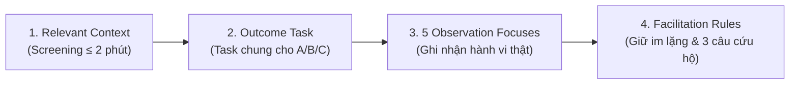

# Day 18 — Chặng 5: Chuẩn bị Test & Facilitation Protocol

**Nhóm:** Chicken Plus  
**Thành viên:** 
1. Phạm Bá Huy (MHV: `2A202601132`) — Facilitator chính / Kỹ thuật  
2. Nguyễn Văn Tuấn Anh (MHV: `2A202601813`) — Facilitator / Quan sát viên  
**Case study:** AI Support Radar trên nền tảng VLearn (Chẩn đoán & hỗ trợ bế tắc bài tập `useEffect`)  
**Thời lượng chuẩn bị:** 15 phút  

---

## 1. Chốt Context và Task (Testing Setup & Alignment)

Mục tiêu của bước này là chuẩn bị chính xác điều kiện thử nghiệm để đo lường hành vi thật của Tester trên cả 3 phương án (Option A, B, C) mà không tạo ra bất kỳ thiên kiến hay gợi ý trước nào.



---

### 1.1. Relevant Context (Sàng lọc nhanh — Tối đa 2 phút)

Trước khi mở prototype, Facilitator hỏi Tester đúng **một câu hỏi context** để xác định độ liên quan về trải nghiệm:

> 💬 **Câu hỏi chuẩn:**  
> *“Gần đây bạn có từng tự học lập trình một mình (nhất là làm bài tập React / JavaScript vào buổi tối hoặc ca đêm), gặp phải một bug khó hiểu như state không cập nhật trong `useEffect` mà không có ai bên cạnh để hỏi ngay không?”*

#### 📌 Quy tắc xử lý dựa trên phản hồi của Tester:

| Phản hồi của Tester | Định hướng phiên Test | Lưu ý phân tích dữ liệu |
| :--- | :--- | :--- |
| **ĐÃ TỪNG (Có Relevant Context)** | Cho tester trải nghiệm đầy đủ A/B/C, tập trung đo cả **sự thuận tiện tương tác** lẫn **giá trị thực tế (Value Claim)** và đánh đổi (Trade-off). | Dữ liệu hợp lệ để đưa ra kết luận về Value Claim và mức độ hữu ích thực tế. |
| **CHƯA TỪNG (Không có Context)** | Vẫn tiến hành test bình thường để tìm **lỗi gãy tương tác (Interaction Breakdown)**, hiểu lầm UI/micro-copy, thao tác bối rối. | **KHÔNG** dùng dữ liệu của tester này để đưa ra các khẳng định mạnh về mặt giá trị sản phẩm (Value Claim). |

---

### 1.2. Outcome Task (Giao nhiệm vụ hướng kết quả)

Facilitator chỉ nói **kết quả cần đạt**, tuyệt đối **không chỉ dẫn thao tác hay đọc tên nút bấm**.

> 🎯 **Câu giao nhiệm vụ chuẩn:**  
> *“Trong tình huống này, bạn vừa chạy thử bài tập `UserProfile.jsx` và thấy Test Case #2 bị FAILED (State `user` không cập nhật). Hãy dùng lần lượt từng phương án (A, B, C) để tìm ra nguyên nhân và sửa mã nguồn sao cho bài tập vượt qua (PASS) toàn bộ kiểm thử.”*

#### ❌ Phân biệt Task sai vs. Task đúng:

* ❌ **Task sai (Nói nút cần bấm - Làm mất giá trị test):**  
  *“Bạn hãy bấm vào nút ‘Cần gợi ý tư duy’ ở góc dưới, đọc 2 câu hỏi của AI rồi gõ câu trả lời vào ô chat nhé.”*  
  *(Hậu quả: Tester biến thành robot bấm nút, không đo được khả năng tự khám phá và hiểu lầm UI).*
* ✅ **Task đúng (Outcome Task - Đo lường hành vi tự nhiên):**  
  *“Hãy dùng công cụ hỗ trợ trên màn hình để tìm nguyên nhân và làm cho Test Case #2 chuyển sang màu xanh (PASS).”*

---

### 1.3. Observation Focus (5 Trọng tâm quan sát hành vi)

Trong suốt quá trình tester thao tác trên Option A, Option B và Option C, Facilitator và Note-taker tập trung ghi chép **5 điểm mấu chốt** sau:

| STT | Trọng tâm quan sát (Focus) | Câu hỏi quan sát thực tế (Checklist hành vi) |
| :---: | :--- | :--- |
| **1** | **First Action** *(Hành động đầu tiên)* | Tester nhìn vào đâu đầu tiên? Đọc code, đọc thông báo lỗi Test Runner, hay tìm ngay nút trợ giúp AI? |
| **2** | **Hesitation & Friction** *(Điểm khựng lại)* | Tester dừng lại lâu ở đâu? Có do dự khi phải bôi đen code (Option B), có khựng lại khi thấy đồng hồ SLA 30 phút (Option C), hay ngập ngừng khi đọc câu hỏi gợi ý (Option A)? |
| **3** | **Evidence Read / Ignored** *(Đọc hay bỏ qua)* | Tester có đọc dòng micro-copy giới hạn (“AI không cho đáp án sẵn”)? Có đọc giải thích và câu hỏi gợi mở không hay chỉ lướt qua tìm đáp án? Có thấy cảnh báo vùng chọn quá ngắn không? |
| **4** | **Misunderstanding & Recovery** *(Hiểu lầm & Phục hồi)* | Có hiểu lầm AI sẽ tự sửa code hộ không? Khi gặp bế tắc hoặc gợi ý chưa đúng, tester có biết dùng nút *“Đổi câu hỏi”*, *“Đóng pop-up”*, hay *“Học bài tiếp”* để phục hồi không? |
| **5** | **Option Choice & Trade-off** *(Lựa chọn & Đánh đổi)* | Khi trải nghiệm xong cả 3, tester ưu tiên chọn phương án nào? Tester chấp nhận đánh đổi gì (Thời gian suy nghĩ lâu để hiểu sâu ở A vs. Nhanh nhưng sợ lệch ở B vs. Độ tin cậy cao nhưng chờ lâu ở C)? |

---

## 2. Bộ Luật Facilitation Chuẩn Mực (Facilitation Rules)

Để đảm bảo kết quả kiểm thử khách quan và phản ánh đúng 100% thực tế, Facilitator phải tuân thủ nghiêm ngặt **6 Luật Cốt Lõi**:

```text
┌────────────────────────────────────────────────────────────────────────┐
│                      6 NGUYÊN TẮC VÀNG KHI FACILITATE                   │
├────────────────────────────────────────────────────────────────────────┤
│ 1. Tester tự điều khiển 100% chuột, bàn phím và prototype.            │
│ 2. Dùng DUY NHẤT một Outcome Task và cùng bộ code fixture cho A/B/C.   │
│ 3. KHÔNG narrate (thuyết minh), không giải thích icon hay tính năng.   │
│ 4. KHÔNG lấp khoảng im lặng — Im lặng chính là dữ liệu quý giá.        │
│ 5. TUYỆT ĐỐI KHÔNG hỏi: "Bạn có thích không?" hay câu hỏi dẫn dắt.     │
│ 6. Khi tester hỏi cách hoạt động ➔ Bật lại câu hỏi cho tester.        │
└────────────────────────────────────────────────────────────────────────┘
```

### Ứng xử khi Tester đặt câu hỏi:
* Khi Tester hỏi: *“Ủa cái nút này bấm vào nó sẽ làm gì vậy bạn?”* hoặc *“Sao AI không hiện code sửa luôn?”*
* ❌ **Không trả lời:** *“À nút đó là để AI gợi ý câu hỏi Socratic cho bạn tự tư duy á.”*
* ✅ **Hỏi ngược lại ngay:** *“Theo bạn, nút đó bấm vào thì nó nên hoạt động như thế nào?”*

---

### Ba Câu Cứu Hộ Thần Thánh (The 3 Rescue Prompts)

Khi phiên test rơi vào bế tắc, im lặng quá lâu hoặc tester có dấu hiệu mất phương hướng, Facilitator **chỉ được phép sử dụng 3 câu nói sau** để kích hoạt lại tư duy của tester:

```text
┏━━━━━━━━━━━━━━━━━━━━━━━━━━━━━━━━━━━━━━━━━━━━━━━━━━━━━━━━━━━━━━━━━━━━━━━━┓
┃                                                                        ┃
┃   🗣️  CÂU 1: "Bạn cứ nói to suy nghĩ trong đầu của mình nhé."          ┃
┃       (Dùng khi: Tester im lặng suy nghĩ hoặc chau mày > 10 giây)       ┃
┃                                                                        ┃
┃   🧭  CÂU 2: "Bạn sẽ làm gì tiếp theo?"                                ┃
┃       (Dùng khi: Tester hoàn thành một bước hoặc dừng lại chưa biết đi đâu) ┃
┃                                                                        ┃
┃   💡  CÂU 3: "Theo bạn, nó nên hoạt động như thế nào?"                 ┃
┃       (Dùng khi: Tester quay sang hỏi facilitator cách dùng / thắc mắc UI)  ┃
┃                                                                        ┃
┗━━━━━━━━━━━━━━━━━━━━━━━━━━━━━━━━━━━━━━━━━━━━━━━━━━━━━━━━━━━━━━━━━━━━━━━━┛
```

---

## 3. Mẫu Ghi Chép Quan Sát Thực Địa (Field Observation Sheet)

*Dùng mẫu này để in ra hoặc ghi chép trực tiếp trong quá trình ngồi cùng Tester:*

### Thông tin phiên Test
* **Mã / Tên Tester:** `........................................................`
* **Có Relevant Context không:** `[ ] Đã từng gặp lỗi tương tự` / `[ ] Chưa từng (chỉ tìm breakdown)`
* **Thứ tự trải nghiệm:** `[ ] A → B → C` | `[ ] B → C → A` | `[ ] C → A → B`
* **Người Facilitate:** `........................................................` | **Note-taker:** `........................................................`

---

### Bảng ghi chép hành vi chi tiết (Fact First — Không diễn giải chủ quan)

| Option | First Action (Hành động đầu tiên) | Hesitation & Gặp khó ở đâu? | Evidence: Đọc hay Lướt qua? | Điểm gãy (Breakdown) & Cách phục hồi | Exact Quotes (Câu nói nguyên văn) |
| :--- | :--- | :--- | :--- | :--- | :--- |
| **Option A** *(Socratic Hints AI)* | | | | | *"..................................................."* |
| **Option B** *(Contextual Explainer)* | | | | | *"..................................................."* |
| **Option C** *(Fast SLA Q&A)* | | | | | *"..................................................."* |

---

### Tổng kết so sánh sau khi hoàn thành 3 Option
1. **Option được tester chọn nếu chỉ được giữ 1:** `[ ] Option A` | `[ ] Option B` | `[ ] Option C`
2. **Lý do & Trade-off chính tester thừa nhận:**  
   `.......................................................................................................................................................`
3. **Phát hiện bất ngờ nhất trong phiên:**  
   `.......................................................................................................................................................`

---

## 4. Tự Kiểm — GATE 4 Readiness Checklist

| Tiêu chí | Trạng thái | Minh chứng chuẩn bị |
| :--- | :---: | :--- |
| **1. Relevant Context rõ ràng (≤ 2 phút)** | ✅ Đạt | Đã có câu hỏi sàng lọc cụ thể về tự học đêm & lỗi `useEffect`. |
| **2. Outcome Task không mớm nút** | ✅ Đạt | Giao nhiệm vụ tìm nguyên nhân & pass Test Case #2, không nói tên nút. |
| **3. Đủ 5 trọng tâm quan sát (Observation Focus)** | ✅ Đạt | Bao phủ First Action, Hesitation, Evidence, Recovery, Option & Trade-off. |
| **4. Nắm vững 6 luật Facilitation & 3 câu cứu hộ** | ✅ Đạt | Đã phân vai rõ ràng, cấm narrate, chuẩn bị sẵn 3 câu chuẩn mực. |
| **5. Sẵn sàng mẫu ghi chép Fact-first** | ✅ Đạt | Đã có template bảng chi tiết để điền trực tiếp khi quan sát. |

**→ Đã sẵn sàng 100% chuyển sang Chặng 6 (Thực hiện Test & Ghi chép Feedback).**
