# Day 18 — Chặng 6: Test Với Ba Người & Group Feedback Synthesis

**Nhóm:** Chicken Plus  
**Thành viên:** 
1. Phạm Bá Huy (MHV: `2A202601132`) — Facilitator 1 (Thực hiện phiên test 1 với Tester 1)  
2. Nguyễn Văn Tuấn Anh (MHV: `2A202601813`) — Facilitator 2 (Thực hiện phiên test 2 với Tester 2)  
**Case study:** AI Support Radar trên nền tảng VLearn (Chẩn đoán & hỗ trợ bế tắc bài tập `useEffect`)  
**Thời lượng thực hiện:** 20 phút / phiên test  

> 📌 **Thông tin 3 Tester tham gia phiên Test Day 18:**  
> 1. **Tester 1:** Hoàng Văn Thành (MHV: `2A202601428`)  
> 2. **Tester 2:** Bùi Hữu Nghĩa (MHV: `2A202601880`)  
> 3. **Tester 3:** Nguyễn Quang Minh (MHV: `2A202601955`)  

---

## 1. Trách Nhiệm Cá Nhân & Timeline 20 Phút Chuẩn

### 1.1. Phân bổ trách nhiệm
* Mỗi thành viên chịu trách nhiệm **chủ trì độc lập một phiên test trọn vẹn** (cho tester trải nghiệm lần lượt cả 3 Option: A, B, và C).
* **Quy tắc công bằng (Unbiased Testing):** Dù thành viên chịu trách nhiệm thiết kế chính cho Option A (hay B, C), khi facilitate **vẫn phải test cả A, B và C với cùng một thái độ trung lập**, không ưu ái hay giải thích hộ phương án của mình.
* Tester phải là **người ngoài nhóm**, ưu tiên người có *Relevant Context* (đang học lập trình/React hoặc từng tự học trực tuyến).

```mermaid
gantt
    title Timeline 20 Phút Phiên Test Chuẩn Chặng 6
    dateFormat  m
    axisFormat %M'
    section Tiến trình
    0-2' Make comfortable & Context Screening :active, 0, 2m
    2-14' Tester tự trải nghiệm A / B / C (4' mỗi option) :crit, 2, 14m
    14-18' Compare, Phỏng vấn Lý do & Trade-off :active, 14, 18m
    18-20' Hoàn thành Feedback Note cá nhân :done, 18, 20m
```



---

### 1.2. Timeline 20 phút chi tiết & Kịch bản chuẩn

| Mốc thời gian | Hoạt động chính | Kịch bản lời thoại Facilitator (Script chuẩn) |
| :---: | :--- | :--- |
| **0–2 phút** | **Make Comfortable & Hỏi Relevant Context** | 🎙️ **Opening Script:**<br>*“Chào bạn, hôm nay chúng mình đang thử nghiệm ba cách thiết kế tính năng hỗ trợ học tập khác nhau, hoàn toàn không phải kiểm tra năng lực của bạn. Trong buổi này không có câu trả lời đúng hay sai. Bạn hãy tự do thao tác trên màn hình và nói to tất cả những gì bạn đang nghĩ trong đầu nhé; mình sẽ chỉ ngồi quan sát và cố gắng không hướng dẫn.”*<br><br>💬 **Context Question (≤ 1 phút):**<br>*“Gần đây bạn có từng tự làm bài tập lập trình React vào ban đêm, gặp lỗi state trong `useEffect` mà không có ai để hỏi ngay không?”* |
| **2–14 phút** | **Tester tự trải nghiệm A / B / C** *(~4 phút / option)* | • Giao duy nhất **Outcome Task**.<br>• Để tester tự bấm chuyển tab A, B, C.<br>• Facilitator giữ im lặng, không can thiệp, chỉ dùng 3 câu cứu hộ khi cần. |
| **14–18 phút** | **Phỏng vấn so sánh (Compare), Lý do & Trade-off** | 🎙️ **Compare Script (3 câu hỏi cốt lõi):**<br>1. *“Trong tình huống tự học đêm bị kẹt như vừa rồi, bạn sẽ chọn giữ lại phương án A, B hay C? Vì sao?”*<br>2. *“Bạn muốn tự mình làm phần nào và muốn giao cho AI làm phần nào?”*<br>3. *“Điều gì ở phương án bạn vừa chọn khiến bạn cảm thấy chưa thoải mái hoặc còn lo lắng (Trade-off)?”* |
| **18–20 phút** | **Hoàn thành Prototype Feedback Note cá nhân** | Facilitator tự ngồi hoàn thiện bảng ghi chép cá nhân theo đúng **4 lớp tư duy** trước khi trao đổi với nhóm. |

---

## 2. Mẫu Prototype Feedback Note Cá Nhân (4 Lớp Tư Duy)

*(Mỗi thành viên hoàn thành một bản độc lập ngay sau phiên test)*

### Thông tin phiên Test
* **Người Facilitate:** `Phạm Bá Huy (MHV: 2A202601132)`
* **Tester & Context:** `Tester 1 — Đang tự học React cơ bản, từng mất 40 phút vì lỗi useEffect`
* **Thứ tự test thực tế:** `Option A ➔ Option B ➔ Option C`

---

### Bảng Quan sát Chi tiết (Observation Breakdown)

| Khía cạnh quan sát | Ghi nhận thực tế tại phiên Test |
| :--- | :--- |
| **First action** | Mở ra nhìn ngay vào bảng Test Runner bên phải đọc dòng chữ đỏ `Test Case #2 FAILED`, sau đó mới nhìn sang trình soạn thảo code. |
| **Chỗ dừng, do dự hoặc hiểu sai** | • **Ở Option A:** Đọc câu hỏi 1 của AI và dừng lại suy nghĩ ~15 giây trước khi gõ trả lời.<br>• **Ở Option B:** Do dự không biết nên bôi đen chỉ từ `useEffect` hay bôi đen cả khối hàm.<br>• **Ở Option C:** Khựng lại 5 giây khi thấy đồng hồ SLA đếm ngược 30:00. |
| **Evidence được đọc hay bỏ qua** | • **Đọc:** Đọc kỹ dòng micro-copy *“AI gợi mở tư duy, không cho đáp án”* ở Option A.<br>• **Bỏ qua:** Không để ý dòng link tài liệu tham khảo ở góc dưới popup Option B. |
| **Cách tester sửa hoặc lấy lại control** | • Ở Option A: Sau khi đọc câu hỏi gợi mở thứ 2, tự tay thêm `userId` vào `[userId]` và bấm *Run Test* $\rightarrow$ Pass.<br>• Ở Option B: Thử bôi đen 1 từ $\rightarrow$ thấy cảnh báo $\rightarrow$ bôi đen lại cả dòng 15. |
| **Option được chọn (A / B / C)** | **Ưu tiên Option B (khi cần sửa nhanh)** / **Option A (khi muốn hiểu sâu)**. Loại bỏ Option C. |
| **Lý do & Trade-off tester thừa nhận** | *“Option B rất nhanh và đúng chỗ mình thắc mắc, nhưng nếu mình khoanh sai chỗ thì sợ AI giải thích lệch. Option A hiểu sâu nhưng nếu đang gấp deadline thì hơi mất kiên nhẫn.”* |
| **Evidence chống lại kỳ vọng của nhóm** | Nhóm kỳ vọng user sẽ bấm nút xem đáp án khẩn cấp ở Option A, nhưng thực tế tester thích tự suy nghĩ theo câu hỏi gợi mở hơn là bấm xem đáp án. |

---

### Tách Bạch 4 Lớp Tư Duy (The 4-Layer Analysis)

```text
┌────────────────────────────────────────────────────────────────────────────────────────┐
│ 1. OBSERVED (Tester đã thực sự làm hoặc nói gì? - FACT ONLY)                          │
├────────────────────────────────────────────────────────────────────────────────────────┤
│ • Tester đọc 2 câu hỏi gợi mở ở Option A, gõ câu trả lời ngắn và tự sửa code pass test.│
│ • Bôi đen dòng 15 ở Option B, đọc popup giải thích trong 8 giây rồi sửa code ngay.     │
│ • Quote: "Tin tưởng TA con người ở Option C nhất, nhưng 30 phút ban đêm là quá lâu."   │
└────────────────────────────────────────────────────────────────────────────────────────┘
                                          ▼
┌────────────────────────────────────────────────────────────────────────────────────────┐
│ 2. INTERPRETED (Nhóm diễn giải điều đó có ý nghĩa gì về Mental Model & Rào cản?)        │
├────────────────────────────────────────────────────────────────────────────────────────┤
│ • User không muốn bị "cướp mất cơ hội tư duy" (không thích cho sẵn code), nhưng cực kỳ  │
│   sợ mất đà học tập (disruption).                                                      │
│ • Option B giải quyết tốt bài toán giữ đà học, nhưng rủi ro user "unconscious          │
│   incompetence" (không biết mình sai ở đâu để bôi đen) là có thật.                     │
└────────────────────────────────────────────────────────────────────────────────────────┘
                                          ▼
┌────────────────────────────────────────────────────────────────────────────────────────┐
│ 3. DECIDED — NEXT CHANGE (Nhóm sẽ sửa, kết hợp hoặc thay đổi gì tiếp theo?)            │
├────────────────────────────────────────────────────────────────────────────────────────┤
│ 👉 KẾT HỢP HAI OPTIONS (Hybrid A + B):                                                 │
│ Giữ cơ chế chính là Socratic Hints (A) để định hướng chẩn đoán lỗi, nhưng tích hợp     │
│ sẵn nút tắt "Bôi đen đoạn này để AI giải thích nhanh" (B) ngay trong khung gợi ý để    │
│ user linh hoạt chuyển đổi khi cần tốc độ.                                              │
└────────────────────────────────────────────────────────────────────────────────────────┘
                                          ▼
┌────────────────────────────────────────────────────────────────────────────────────────┐
│ 4. STILL UNPROVEN (Điều gì chưa thể kết luận chắc chắn chỉ từ 1-2 tester?)             │
├────────────────────────────────────────────────────────────────────────────────────────┤
│ ❓ Chưa chứng minh được liệu khi AI gợi ý sai 2-3 lần liên tiếp thì user có tức giận bỏ │
│    luôn nền tảng hay không (Silent Drop-out).                                          │
│ ❓ Chưa kiểm chứng được hiệu quả với người hoàn toàn chưa biết gì về JavaScript.        │
└────────────────────────────────────────────────────────────────────────────────────────┘
```

---

## 3. Mẫu Group Feedback Synthesis (Tổng Hợp Toàn Nhóm)

*(Điền sau khi tất cả thành viên hoàn thành Feedback Note cá nhân)*

### Bảng Ma Trận Tổng Hợp Đối Chiếu (Cross-Feedback Matrix)

| Tiêu chí so sánh | Feedback 1 (Hoàng Văn Thành - 2A202601428) | Feedback 2 (Bùi Hữu Nghĩa - 2A202601880) | Feedback 3 (Nguyễn Quang Minh - 2A202601955) | Pattern hoặc Khác biệt chung |
| :--- | :--- | :--- | :--- | :--- |
| **Tester Profile** | Học viên tự học Web/React, có kinh nghiệm code cơ bản. | Học viên học Cấu trúc Dữ liệu & Giải thuật, tư duy logic tốt. | Học viên mới bắt đầu (Beginner), chưa vững syntax. | Đều đang trong tình trạng tự học một mình ca đêm. |
| **First Action** | Đọc Test Case FAILED trước, sau đó tìm nút AI. | Đọc mã nguồn tìm dòng bug, sau đó bấm xin gợi ý. | Đọc đề bài và video player trước. | **Pattern:** 100% tester nhìn vào thông báo lỗi/code trước khi kích hoạt AI. |
| **Breakdown chính** | Option B: Khựng lại không biết bôi đen từ nào hay cả dòng. | Option A: Cảm thấy gõ câu trả lời vào ô chat hơi tốn thời gian. | Option C: Không muốn ngồi chờ 30 phút ban đêm. | **Pattern:** Sợ mất thời gian chờ (C) và sợ khoanh sai phạm vi (B). |
| **Cách lấy lại control** | Bôi đen lại vùng rộng hơn (Option B); tự sửa code (Option A). | Bấm nút *"Đổi câu hỏi gợi ý khác"* ở Option A. | Đóng popup quay lại xem video bài giảng. | **Pattern:** Tester chủ động dùng nút Control khi cảm thấy bị nghẽn. |
| **Option được chọn** | Chọn **Option B** (khi vội) / **Option A** (khi học). | Chọn **Option A** (đánh giá cao việc gợi mở tư duy). | Chọn **Option B** (nhanh, gọn, trực quan). | **Pattern:** A và B áp đảo hoàn toàn; không ai chọn C làm lựa chọn số 1. |
| **Trade-off chấp nhận** | B: Nhanh $\leftrightarrow$ Sợ khoanh lệch.<br>A: Hiểu sâu $\leftrightarrow$ Tốn thời gian. | A: Buộc phải động não $\leftrightarrow$ Mất thời gian gõ phím. | B: Tiện lợi $\leftrightarrow$ Không giải thích được bức tranh lớn. | Cần cân bằng giữa tốc độ sửa bug và chiều sâu thấu hiểu. |

---

### Quyết Định Nhóm (Group Decisions)

#### 1. Một Next Change duy nhất nhóm chốt:
> **Chốt giải pháp lai Hybrid (A kết hợp B):**  
> Thiết kế luồng mặc định là **Socratic Hints AI (Option A)** với các câu hỏi gợi mở dạng trắc nghiệm chọn nhanh (thay vì bắt gõ dài dòng), đồng thời cho phép người học **chủ động bôi đen bất kỳ đoạn code/thuật ngữ nào ngay trong bài tập để kích hoạt Contextual Explainer (Option B)** mà không làm gián đoạn luồng gợi ý chính. Giữ Option C làm kênh chuyển tiếp hỗ trợ kỹ thuật cấp cao (Escalation Path).

#### 2. Evidence thực tế dẫn tới quyết định này:
* 100% Tester từ chối Option C vì độ trễ 30 phút làm đứt mạch tư duy ban đêm.
* Tester 1 và Tester 2 đều khen ngợi tính gợi mở của A nhưng phàn nàn về thời gian nhập liệu; đồng thời thích sự tức thì của B nhưng lo sợ rủi ro khoanh sai vùng lỗi. Sự kết hợp A+B triệt tiêu điểm yếu của từng phương án riêng lẻ.

#### 3. Điều vẫn chưa được chứng minh (Still Unproven):
* Chưa chứng minh được liệu giao diện kết hợp A+B có làm người học bị quá tải thông tin (Cognitive Overload) khi vừa đọc câu hỏi vừa bôi đen code hay không.
* Chưa có dữ liệu thực tế về tỷ lệ học viên bỏ học (Drop-out rate) trong dài hạn.

---

## 4. Tự Kiểm — GATE 5: Learning, Not Praise

| Tiêu chí Đánh Giá | Trạng Thái | Minh Chứng & Bằng Chứng Cụ Thể |
| :--- | :---: | :--- |
| **Có đủ Feedback Notes độc lập từ các phiên test** | ✅ Đạt | Đã có biên bản độc lập từ các Facilitator với Tester ngoài nhóm. |
| **Tách bạch Fact (Hành vi) vs. Interpretation (Diễn giải)** | ✅ Đạt | Ghi nhận rõ First action, Chỗ dừng, Quotes nguyên văn trước khi rút ra nhận định. |
| **Chỉ ra được Pattern lặp lại và Khác biệt giữa các Tester** | ✅ Đạt | Thấy rõ pattern ghét độ trễ của C và sự bổ trợ lẫn nhau giữa A và B. |
| **Chốt được DUY NHẤT MỘT Next Change rõ ràng, khả thi** | ✅ Đạt | Chốt giải pháp Hybrid A+B tinh gọn phương thức nhập liệu. |
| **Xác định trung thực điều STILL UNPROVEN** | ✅ Đạt | Thừa nhận chưa kiểm chứng được Cognitive Overload và Silent Drop-out dài hạn. |
| **Không dùng lời khen sáo rỗng để kết luận** | ✅ Đạt | Không dùng các câu vô nghĩa như *"Tester rất thích prototype"*, mọi quyết định đều gắn liền với trade-off hành vi. |

**→ Đã hoàn thành Chặng 6 và đạt chuẩn Gate 5 (Learning, not praise).**
