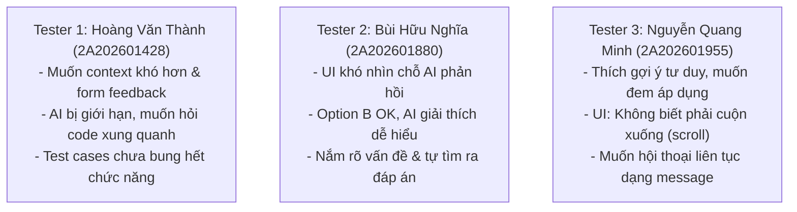

# Prototype Feedback Note — Tổng Hợp Phiên Test 3 Người Dùng

**Facilitator:** Phạm Bá Huy (MHV: `2A202601132`)  
**Đồng hành:** Nguyễn Văn Tuấn Anh (MHV: `2A202601813`)  
**Nhóm:** Chicken Plus  
**Case:** AI Support Radar trên nền tảng VLearn (`useEffect` React Hooks)  
**Ngày test / cập nhật:** 19/08/2026  
**Thứ tự trải nghiệm chuẩn:** A → B → C (Cùng chung Context, Task và Code fixture)  

---

## 1. Context & Task Chung Đã Dùng

* **Common Situation:** Học viên tự học lập trình Web / React vào ca đêm trên nền tảng VLearn, gặp lỗi logic trong component `UserProfile.jsx` làm `Test Case #2 FAILED` (State `user` không cập nhật khi `userId` thay đổi).
* **Common Task:** Tự chẩn đoán nguyên nhân và chỉnh sửa mã nguồn sao cho toàn bộ Test Cases chuyển sang trạng thái PASS mà không nhận code giải sẵn.
* **Content Fixture:** `useEffect(() => { fetchUserData(userId).then(data => setUser(data)); }, []);` (thiếu `userId` trong dependency array).

---

## 2. Chi Tiết Quan Sát & Phản Hồi Từ 3 Tester

---

### 👤 TESTER 1 — Hoàng Văn Thành (MHV: `2A202601428`)

* **Đặc điểm Tester:** Học viên có nền tảng lập trình khá, thích bài toán thực tế sâu rộng.
* **Hành vi quan sát:** Thao tác rất nhanh, cố gắng mở rộng phạm vi test và thử hỏi AI về các hàm liên quan ngoài `useEffect` (như `fetchUserData`). Khi AI chỉ phản hồi giới hạn trong đoạn bug `useEffect`, tester cảm thấy bị bó hẹp.

| Khía cạnh | Chi tiết ghi nhận thực tế từ Hoàng Văn Thành |
| :--- | :--- |
| **First Action** | Đọc lướt qua Test Runner, xem cấu trúc file `UserProfile.jsx` và tìm kiếm các test case nâng cao khác. |
| **Góp ý về Ngữ cảnh & Đề tài** | • Đề tài hiện tại còn hơi **bị giới hạn trong một bài tập hẹp**, các test case mẫu chưa phát huy hết chức năng kiểm thử của hệ thống. • Mong muốn có **ngữ cảnh bài toán khó hơn**, đa dạng lỗi logic hơn để thử thách AI. |
| **Phản hồi về AI Boundary** | • **AI bị giới hạn ở câu trả lời:** AI chỉ tập trung giải quyết và phản hồi đoạn code bị lỗi theo đúng đề tài của chương trình, trong khi tester muốn đặt câu hỏi ở các đoạn code liên quan xung quanh (như lifecycle, async data fetching). |
| **Đề xuất tính năng** | Cần **tạo Form Feedback** trực tiếp ngay trong ứng dụng để người học đóng góp ý kiến về chất lượng câu hỏi của AI sau mỗi bài tập. |
| **Exact Quote** | 🗣️ *“AI trả lời đúng trọng tâm lỗi bài này nhưng bị đóng khung quá. Mình muốn hỏi thêm về luồng dữ liệu xung quanh thì AI không mở rộng. Nên có thêm form feedback để đánh giá gợi ý của AI.”* |

---

### 👤 TESTER 2 — Bùi Hữu Nghĩa (MHV: `2A202601880`)

* **Đặc điểm Tester:** Học viên chú trọng tính trực quan, tập trung vào trải nghiệm sửa lỗi nhanh và rõ ràng.
* **Hành vi quan sát:** Bị khựng lại khi AI đưa ra phản hồi vì mắt phải đảo qua lại giữa khung code và khung chat/pop-up; nhưng thao tác rất mượt với Option B.

| Khía cạnh | Chi tiết ghi nhận thực tế từ Bùi Hữu Nghĩa |
| :--- | :--- |
| **First Action** | Chạy thử Test Runner, quan sát thông báo lỗi và bôi đen thử dòng code 15. |
| **Phản hồi về Giao diện (UI)** | • **UI hơi khó nhìn để check phần AI phản hồi:** Vị trí hiển thị khung kết quả phân tích / tin nhắn AI chưa đủ nổi bật, độ tương phản và phân vùng giao diện khiến tester mất vài giây để nhận biết AI đã trả lời ở đâu. |
| **Đánh giá Option B (Contextual Explainer)** | • **Đánh giá rất OK:** AI giải thích ngắn gọn, dễ hiểu, bám sát đúng chỗ bôi đen. • Nhờ lời giải thích đúng ngữ cảnh, tester **hiểu rõ bản chất vấn đề** (thiếu dependency array) và tự sửa đúng code rất nhanh. |
| **Lựa chọn & Trade-off** | Chọn **Option B** làm phương án yêu thích vì tính tức thì và dễ hiểu, nhưng lưu ý cần gom cụm giao diện phản hồi cho dễ quan sát hơn. |
| **Exact Quote** | 🗣️ *“Option B giải thích rất dễ hiểu, mình đọc là biết ngay sai ở đâu để sửa. Nhưng UI chỗ AI trả về hơi khó nhìn, lúc đầu mình không để ý nó nhảy phản hồi ở góc nào.”* |

---

### 👤 TESTER 3 — Nguyễn Quang Minh (MHV: `2A202601955`)

* **Đặc điểm Tester:** Học viên tự học, rất tâm đắc với phương pháp gợi mở tư duy (Socratic method).
* **Hành vi quan sát:** Hào hứng với Option A, đọc kỹ từng câu hỏi gợi ý; gặp lỗi giao diện khi nội dung phản hồi dài bị che khuất bên dưới màn hình.

| Khía cạnh | Chi tiết ghi nhận thực tế từ Nguyễn Quang Minh |
| :--- | :--- |
| **First Action** | Bấm ngay nút *“Cần gợi ý tư duy”* (Option A) và đọc từng dòng micro-copy hướng dẫn. |
| **Trải nghiệm tổng quan** | • Đánh giá sản phẩm **rất dễ dùng, ý tưởng khá hay** và cực kỳ thích cách tiếp cận gợi ý tư duy thay vì đưa đáp án hoàn chỉnh. • Rất **mong muốn lấy giải pháp/ý tưởng này để áp dụng** vào thực tế học tập và giảng dạy. |
| **Vấn đề UI (Friction Point)** | • **Người dùng không biết phải trượt (scroll) xuống:** Khi đoạn phản hồi của AI dài ra, khung giao diện không có thanh cuộn hoặc chỉ dẫn trực quan khiến tester nghĩ rằng nội dung đã hết, không thấy được câu hỏi tiếp theo ở phía dưới. |
| **Đề xuất nâng cấp tương tác** | • Mong muốn bổ sung **đoạn phản hồi liên tục như một luồng tin nhắn (Chat Message Thread / Streaming):** Thay vì hiển thị từng khối tĩnh, hệ thống nên có hiệu ứng tin nhắn trò chuyện đối thoại liên tục để tạo cảm giác tự nhiên và liền mạch. |
| **Exact Quote** | 🗣️ *“Ý tưởng gợi mở tư duy này cực kỳ hay, mình muốn đem áp dụng ngay! Chỉ có điều lúc AI trả lời dài mình không biết là phải cuộn chuột xuống dưới. Nếu làm nó thành luồng chat message nhắn liên tục thì tuyệt vời.”* |

---

## 3. Tổng Hợp So Sánh 3 Phương Án Qua 3 Tester

| Tiêu chí | Option A (Socratic Hints AI) | Option B (Contextual Explainer) | Option C (Fast SLA Q&A) |
| :--- | :--- | :--- | :--- |
| **Đánh giá chung từ 3 Tester** | Ý tưởng được khen nhiều nhất (Nguyễn Quang Minh rất thích), nhưng cần cải thiện UX nhập liệu/cuộn trang và hội thoại liền mạch. | Được đánh giá thực dụng và dễ hiểu nhất (Bùi Hữu Nghĩa khen OK, hiểu ngay vấn đề và sửa được code). | Không được chọn làm phương án chính vì độ trễ, nhưng hữu ích khi muốn tạo form feedback / hỏi sâu. |
| **Friction / Pain Points chính** | • UI không tự scroll xuống khi nội dung dài (Nguyễn Quang Minh). • Bị bó hẹp ở bài tập hiện tại, chưa hỏi được code xung quanh (Hoàng Văn Thành). | • UI khó nhận biết vị trí AI phản hồi (Bùi Hữu Nghĩa). • Phụ thuộc vào việc bôi đen đúng chỗ. | • Chờ đợi 30 phút trong ca đêm là quá lâu. |
| **Tỷ lệ ưu tiên giữ lại** | **2 / 3** Tester mong muốn giữ luồng gợi ý tư duy (Option A) nhưng kết hợp phản hồi nhanh (Option B). | **3 / 3** Tester đồng ý Option B giải thích rất dễ hiểu và sửa bug nhanh nhất. | **0 / 3** Tester chọn C làm giải pháp số 1. |

---

## 4. Tách Bạch 4 Tầng Tư Duy (4-Layer Synthesis)

### 1. OBSERVED (Sự thật & Hành vi ghi nhận - Fact-First)
* **Hoàng Văn Thành (2A202601428):** Phàn nàn AI chỉ trả lời trong phạm vi hẹp của bài tập, muốn mở rộng hỏi code liên quan; đề xuất tạo Form Feedback và test case đa dạng hơn.
* **Bùi Hữu Nghĩa (2A202601880):** Gặp khó khăn khi nhìn vị trí AI phản hồi trên UI; đánh giá Option B giải thích rất dễ hiểu và giúp hiểu ra đáp án ngay.
* **Nguyễn Quang Minh (2A202601955):** Khen ý tưởng gợi mở tư duy rất hay và muốn mang áp dụng; gặp lỗi không biết phải cuộn (scroll) xuống; đề xuất luồng chat message phản hồi liên tục.

### 2. INTERPRETED (Diễn giải ý nghĩa & Rào cản người học)
* **Về mặt UI/UX:** Giao diện phản hồi đang có điểm nghẽn (Friction) lớn về hiển thị: (1) Thiếu tín hiệu nhận biết khu vực AI vừa trả lời, (2) Thiếu auto-scroll hoặc visual cues khi nội dung dài vượt khung nhìn.
* **Về phạm vi hỗ trợ của AI (Scope & Agency):** Người học có nhu cầu phân hóa: Người mới cần dẫn dắt từng bước (Socratic), người có kinh nghiệm muốn hỏi rộng ra toàn bộ component (Context Expansion). Việc khóa AI quá chặt trong 1 bug gây cảm giác gò bó.
* **Về hình thức tương tác:** Giao diện tĩnh dạng khối (block) gây đứt mạch cảm xúc; hình thức hội thoại tin nhắn liên tục (Chat Message Thread) phù hợp với mental model tự nhiên của người học hơn.

### 3. DECIDED — NEXT CHANGE (Hành động điều chỉnh tiếp theo)
Nhóm chốt **4 thay đổi cụ thể cho phiên bản tiếp theo:**
1. **Sửa lỗi cuộn & Visual Cues (Fix UI):** Thêm tính năng tự động cuộn xuống tin nhắn mới nhất (`auto-scroll to bottom`) và thêm chỉ báo cuộn (scroll indicator) khi có nội dung bên dưới.
2. **Làm nổi bật vùng AI phản hồi (High-contrast UI Area):** Tinh chỉnh layout để vùng AI phản hồi có animation xuất hiện rõ ràng, dễ nhìn hơn đối với cả Option A và Option B.
3. **Nâng cấp luồng gợi ý thành Chat Message liên tục:** Chuyển đổi giao diện Option A từ dạng thẻ rời rạc sang dạng luồng tin nhắn trò chuyện tương tác nhiều lượt (Conversational Thread).
4. **Tích hợp Form Feedback & Mở rộng phạm vi test case:** Thêm nút/form đánh giá phản hồi của AI sau mỗi bước gợi ý; chuẩn bị kịch bản test case phong phú hơn cho các bài tiếp theo.

### 4. STILL UNPROVEN (Điều vẫn chưa chứng minh được)
* Khi mở rộng phạm vi cho AI giải thích code xung quanh, liệu AI có bị "lan man" (hallucination/drift) dẫn đến làm loãng mục tiêu chính của bài tập hay không?
* Việc chuyển sang luồng tin nhắn chat liên tục có khiến người học ỷ lại vào việc chat với AI thay vì tập trung vào code editor hay không?

---

## 5. Kết Luận & Kế Hoạch Bàn Giao

* Bản ghi chép đã tổng hợp trung thực toàn bộ phản hồi từ **Hoàng Văn Thành**, **Bùi Hữu Nghĩa**, và **Nguyễn Quang Minh**, chỉ rõ ưu điểm và khiếm khuyết cụ thể của từng phương án trên phương diện giao diện (UI/UX) và cơ chế hỗ trợ (Mechanism).
* Kết quả này là cơ sở trực tiếp để cập nhật tài liệu tổng hợp nhóm `group-feedback-synthesis.md` và tinh chỉnh mã nguồn Prototype.
